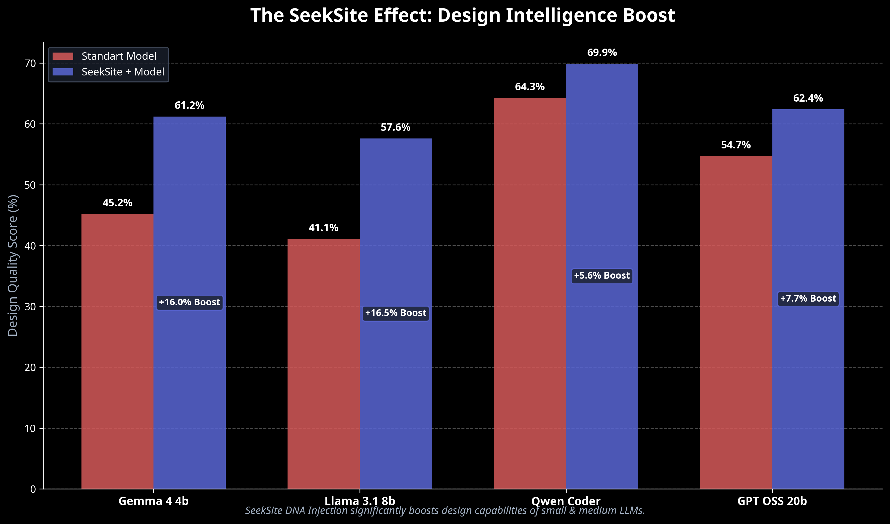

# 🚀 SeekSite: Local AI Website Builder

**Small Models, Big Designs.** 
SeekSite transforms small language models (4b, 8b, 12b, 20b) into professional web designers, operating entirely locally.

---

## 📊 The SeekSite Effect: Design Intelligence Boost

SeekSite's "Design DNA Injection" architecture radically enhances the design capabilities of local models. The graph below illustrates the significant difference between standard models and those integrated with SeekSite.



### Performance Benchmark Table

| Model | Standard Score | **SeekSite Score** | **Boost** |
| :--- | :---: | :---: | :---: |
| **Gemma 4 4b** | 45.2% | **61.2%** | **+16.0%** |
| **Llama 3.1 8b** | 41.1% | **57.6%** | **+16.5%** |
| **Qwen Coder** | 64.3% | **69.9%** | **+5.6%** |
| **GPT OSS 20b** | 54.7% | **62.4%** | **+7.7%** |

---

## 🌟 Why SeekSite?

Traditional small models (SLMs) often lack design capabilities, leading to inconsistent colors and broken layouts. SeekSite solves this fundamental problem with its **"Design DNA Injection"** architecture.

### 🧬 Design DNA Engine
Instead of burdening models with creative design tasks, we inject them with pre-optimized, modern, and responsive CSS components (Design DNA). The model then only needs to logically assemble these components and fill in the content. The result: **Professional designs, achieved with local models!**

---

## ✨ Key Features

- **🏠 100% Local & Private:** Thanks to Ollama integration, your data never leaves your computer. No internet connection required.
- **⚡ Small Model Optimization:** Achieve professional results with models ranging from 4b to 12b, such as Llama 3, Mistral, Gemma, or Phi-3.
- **🔄 Auto-Continuation:** If code generation is interrupted, the system automatically detects it and resumes from where it left off.
- **🎨 Dynamic Design:** Automatic color palette and design language selection based on user requests.
- **🛠️ Live Preview Support:** Instantly view and edit generated code in the browser.

---

## 🛠️ Setup

### 1. Requirements
- Python 3.10+
- [Ollama](https://ollama.com/) (To run local models)

### 2. Steps
```bash
# Clone the repository
git clone https://github.com/Gazi-AI/SeekSite.git
cd SeekSite

# Install dependencies
pip install -r requirements.txt

# Download a model with Ollama (e.g., Llama 3.1)
ollama run llama3.1

# Start the application
python app.py
```

Once the application is started, navigate to `http://localhost:5000` in your browser to start generating your own websites!

---

## 🤝 Contribute

SeekSite is an open-source project. Feel free to send Pull Requests for any contributions, bug reports, or feature suggestions!

---

**Developed by:** [Gazi-AI]
*Powered by Ollama & Design DNA Architecture*
